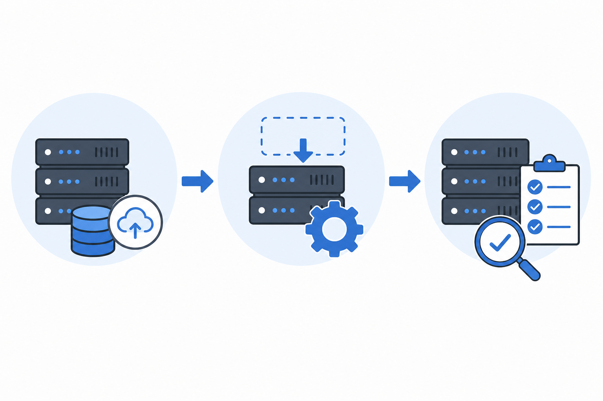
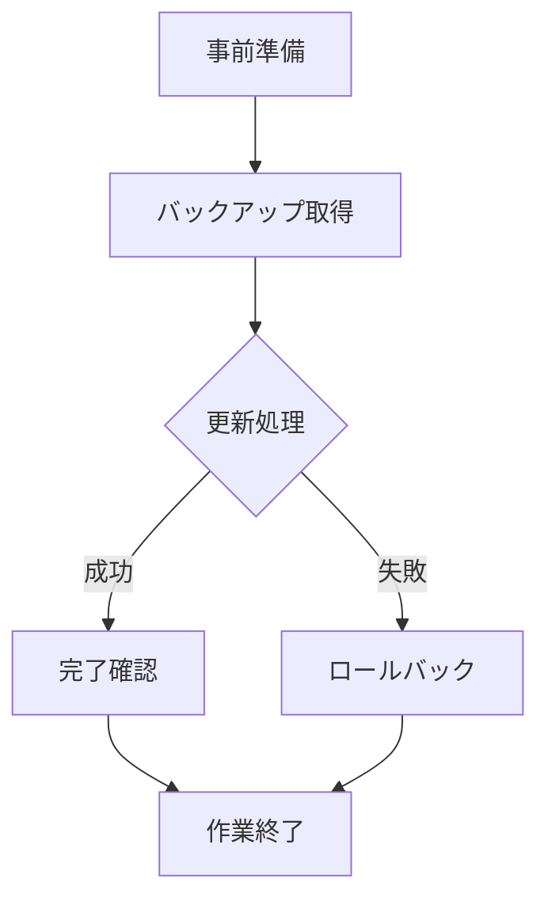

---
tags: [SOP, template]
date: 2026-07-06
status: draft
related: "ドキュメント作成最速化戦略"
print_background: true
---

> **【運用ルール】**
> - 更新時は、Frontmatterの `date` と、本文の「最終更新日」および「10. 変更履歴」を必ず同期させること。
> - コピーして実手順書として運用を開始する際は、Frontmatterの `status` を `draft` から `active` に変更すること。
> - 実運用開始時は、本「運用ルール」ブロックごと削除すること（PDF配布物には含めない）。
> - PDF/HTML出力時はエディタ側の自動目次生成を利用するため、手動での目次記述は行わない。
> - 目次の `<!-- code_chunk_output -->` ブロックは MPE が自動生成する。手編集不要。プレビュー保存時に差分が出ても問題ない。
> - PDFは Markdown Preview Enhanced の「Chrome (Puppeteer) / PDF」で出力すること（`~/.crossnote/style.less` が適用される）。
> - `<div class="page-break"></div>` は PDF の改ページ用マーカー。削除・移動しないこと。
> - 画像は `images/` に配置し、`` でサイズを指定すること。
> - 図と表のタイトルはそれぞれ `図：[名称]` / `表：[名称]` の形式で記載すること。


# 〇〇作業手順書

**最終更新日:** YYYY-MM-DD | **更新者:** 名前 | **バージョン:** 1.0

---

<!-- @import "[TOC]" {cmd="toc" depthFrom=1 depthTo=6 orderedList=false} -->

<!-- code_chunk_output -->

- [〇〇作業手順書](#〇〇作業手順書)
  - [1. 目的と対象者](#1-目的と対象者)
  - [2. 前提条件](#2-前提条件)
  - [3. 準備するもの](#3-準備するもの)
  - [4. 変数・固定情報](#4-変数固定情報)
  - [5. 全体フロー](#5-全体フロー)
  - [6. 作業手順](#6-作業手順)
    - [6.1 【フェーズ1】事前準備・バックアップ](#61-フェーズ1事前準備バックアップ)
    - [6.2 【フェーズ2】メイン処理](#62-フェーズ2メイン処理)
    - [6.3 【フェーズ3】完了確認（成功条件）](#63-フェーズ3完了確認成功条件)
    - [6.4 ロールバック手順](#64-ロールバック手順)
  - [7. トラブルシューティング](#7-トラブルシューティング)
  - [8. 問い合わせ先・エスカレーション](#8-問い合わせ先エスカレーション)
  - [9. 関連資料](#9-関連資料)
  - [10. 変更履歴](#10-変更履歴)

<!-- /code_chunk_output -->


## 1. 目的と対象者

本手順の全体像:



<p class="fig-caption">図：作業概要（バックアップ→更新→確認の流れ）</p>

- **目的:** 本手順書により達成する具体的なゴール（例：〇〇システムの本番環境デプロイ）
- **対象者:** 本手順を実行する想定の担当者
- **所要時間の目安:** 約〇〇分
- **スコープ外（やらないこと）:** 本手順の対象外となる作業（例：既存データベースのレコード修正は含まない）

> **補足:** 本テンプレートは Linux サーバー上の CLI 作業を想定している。GUI 操作が中心の手順は「6. 作業手順」を画面操作ベースに差し替えること。

## 2. 前提条件

作業開始前に、システムや環境が以下の状態を満たしているか確認する。

- [ ] 必要な権限: 〇〇サーバーの `sudo` 権限を保持していること
- [ ] 環境状態: メンテナンスウィンドウ（深夜2:00〜4:00）内であること

## 3. 準備するもの

作業者が手元に用意しておくべき物理的・論理的リソース。

- [ ] 必要なツール: 最新のデプロイ用パッケージ（`app_v2.tar.gz`）
- [ ] 関連資料: 事前に承認された作業申請書のURL

## 4. 変数・固定情報

作業環境に合わせて以下の値を書き換える、または確認する。

<p class="table-caption">表：固定情報（GUI等）</p>

| 項目 | 値 |
| :--- | :--- |
| 対象システム | 〇〇プロダクション環境 |
| 管理画面URL | `https://admin.example.com` |

**変数定義（CLI用）:**

ターミナルでの作業前に以下のコマンドをペーストして実行し、環境変数をセットすること。以降の手順での手動書き換えは禁止する。

```bash
export TARGET_DIR="/var/www/html"
export BACKUP_DATE=$(date +%Y%m%d)
export SERVICE_NAME="nginx"
```

<div class="page-break"></div>

## 5. 全体フロー



<p class="fig-caption">図：作業全体フロー</p>

<div class="page-break"></div>

## 6. 作業手順

### 6.1 【フェーズ1】事前準備・バックアップ

1. 事前状態の検証（対象サービスが稼働していること）

   ```bash
   systemctl is-active --quiet ${SERVICE_NAME} || { echo "ERROR: サービス停止中"; false; }
   ```

2. 設定ファイルを退避する。

   ```bash
   cp -a ${TARGET_DIR}/config ${TARGET_DIR}/config.bak_${BACKUP_DATE}
   ```

3. **【確認】** バックアップファイルが生成されたことを確認する。

   ```bash
   ls -l ${TARGET_DIR} | grep config.bak
   ```

### 6.2 【フェーズ2】メイン処理

1. 更新処理を実行する。

   ```bash
   # 実行コマンドをここに記載（パスは必ず $TARGET_DIR 等の変数を使用すること）
   ```

   <blockquote class="alert-warning">
   <strong>警告:</strong> ここでエラー出力（<code>FAILED</code> 等）が出た場合は作業を中断し、「6.4 ロールバック手順」へ進むこと。
   </blockquote>

### 6.3 【フェーズ3】完了確認（成功条件）

本作業が正常に完了したとみなすためのアサーション（判定条件）。

- [ ] コマンド結果: `systemctl status ${SERVICE_NAME}` が `active (running)` であること。
- [ ] ログ出力: エラーログ（`tail -n 50 /var/log/error.log`）に直近の致命的な出力がないこと。

### 6.4 ロールバック手順

手順途中で致命的なエラーが発生した場合、または完了確認で条件を満たさなかった場合、速やかに元の状態へ復旧させる。

1. バックアップから設定をリストアする。

   ```bash
   cp -a ${TARGET_DIR}/config.bak_${BACKUP_DATE} ${TARGET_DIR}/config
   systemctl restart ${SERVICE_NAME}
   ```

2. **【確認】** 復旧後、システムが作業前の正常な状態で稼働していることを担保する。

<div class="page-break"></div>

## 7. トラブルシューティング

- **事象:** `cp: cannot create ... Permission denied` が出る。
  - **原因:** `sudo` 権限がない、または `${TARGET_DIR}` の所有者が異なる。
  - **対処:** `ls -ld ${TARGET_DIR}` で権限を確認し、必要なら管理者にエスカレーションする。

- **事象:** 「権限がありません」というエラーが出る。
  - **原因:** 対象アカウントに〇〇ロールが付与されていない。
  - **対処:** 管理者画面から〇〇ロールを追加し、再度ログインし直す。

## 8. 問い合わせ先・エスカレーション

本手順書通りに進めても解決しない場合や、ロールバックが正常に完了しない場合の緊急連絡先。

- **担当部署:** 〇〇部 〇〇チーム
- **連絡手段:** Slackの `#問い合わせチャンネル` 宛に `@〇〇` でメンションする。

## 9. 関連資料

- [関連ドキュメント名](https://example.com/docs/related)
- [作業申請書URL](https://...)

## 10. 変更履歴

<p class="table-caption">表：変更履歴</p>

| 日付 | バージョン | 変更内容 | 変更者 |
| :--- | :--- | :--- | :--- |
| YYYY-MM-DD | 1.0 | 初版作成 | 名前 |
